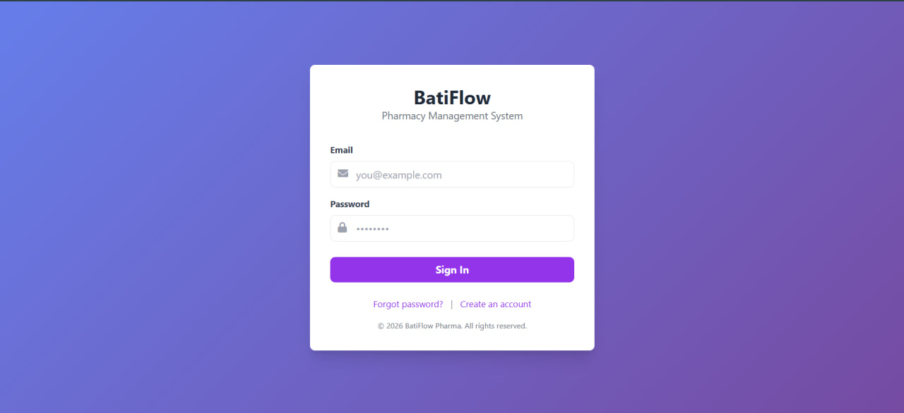
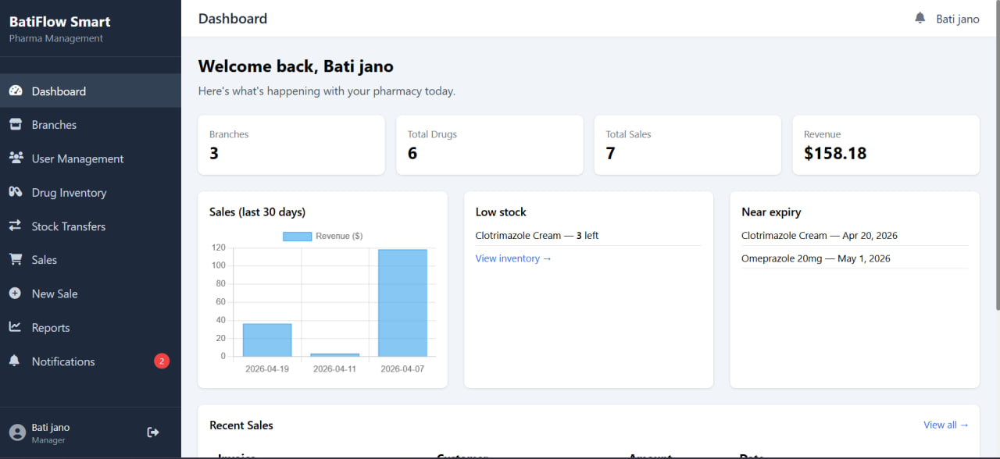

# BatiFlow Smart Pharma – Pharmacy Management System

A complete, role‑based Pharmacy Management System built with **PHP (no framework)**, **MySQL**, and vanilla **HTML/CSS/JavaScript**.  
Manage inventory, sales, stock transfers, users, branches, and analytics – all from a responsive web interface.
### Login Page

---
### Manager Dashboard page

🗄️ Database (phpMyAdmin)
http://localhost/phpmyadmin

🌐 Application Preview (Frontend)
http://localhost/pharmacy-management-system/frontend/index.php

## ✨ Features

### Manager (Owner)
- **Branch Management** – create, edit, delete branches.
- **User Management** – invite/activate/deactivate pharmacists and store keepers.
- **Inventory Oversight** – view all drugs across branches, monitor stock levels, expiry alerts.
- **Pricing Management** – update drug prices.
- **Sales & Reporting** – daily/weekly/monthly sales reports, revenue by branch/pharmacist, top drugs.
- **Analytics** – revenue trends, slow‑moving drugs, profit analysis.

### Pharmacist
- **Sales Processing** – search drugs, add to cart, generate invoice (printable).
- **Prescription Handling** – optional prescription reference.
- **Sales Tracking** – view own daily/weekly/monthly sales.
- **Stock Usage** – automatic stock deduction after sale.

### Store Keeper
- **Drug Inventory** – add/edit drugs, batch tracking, expiry dates.
- **Stock Management** – update stock (receive, adjust, record damaged/expired).
- **Stock Transfers** – move stock from store to dispensary, view transfer history.
- **Low Stock & Expiry Alerts** – receive notifications.

### General (All Roles)
- **Authentication** – login/logout, password reset (email).
- **Role‑Based Menus** – sidebar adapts to user role.
- **Search & Filter** – drugs by name/category/batch, reports by date/branch.
- **Notifications** – real‑time low stock and expiry alerts (badge and list).

---

## 👥 User Roles & Permissions

| Feature                             | Manager |   Pharmacist   | Store Keeper |
| ----------------------------------- | :-----: | :------------: | :----------: |
| Manage branches                     |    ✅    |       ❌        |      ❌       |
| Manage users                        |    ✅    |       ❌        |      ❌       |
| View all drugs (all branches)       |    ✅    | ✅ (own branch) |      ✅       |
| Add/edit drugs                      |    ❌    |       ❌        |      ✅       |
| Update stock                        |    ❌    |       ❌        |      ✅       |
| Transfer stock (store ↔ dispensary) |    ❌    |       ❌        |      ✅       |
| Process sales / invoices            |    ❌    |       ✅        |      ❌       |
| View own sales                      |    ❌    |       ✅        |      ❌       |
| View global reports                 |    ✅    |       ❌        |      ❌       |
| Receive low stock / expiry alerts   |    ✅    |       ✅        |      ✅       |

---

## 🛠 Technology Stack

- **Backend**: PHP 8+ (native, no framework)
- **Database**: MySQL (MariaDB)
- **Frontend**: HTML5, CSS3 (Tailwind CSS), vanilla JavaScript
- **Charts**: Chart.js CDN
- **Icons**: Font Awesome 6
- **Server**: Apache (XAMPP / WAMP / LAMP)

---

## 📦 Installation

### Requirements
- PHP 7.4 or higher (8.x recommended)
- MySQL 5.7 or higher
- Apache with `mod_rewrite` enabled
- Composer (optional, for email libraries)

### Step‑by‑Step Setup

1. **Clone or download** the project into your web server’s document root (e.g., `C:\xampp\htdocs\` for XAMPP).

2. **Create the database**  
   - Open phpMyAdmin or MySQL command line.  
   - Create a database named `pharmacy_db`.  
   - Import the schema: `database/schema.sql`.  
   - Import sample data: `database/seed.sql`.

3. **Configure database connection**  
   Edit `backend/config/database.php`:
   ```php
   $host = 'localhost';
   $dbname = 'pharmacy_db';
   $username = 'root';
   $password = '';

   
