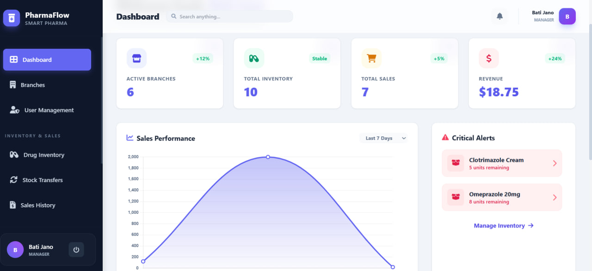

# PharmaFlow – Pharmacy Management System

PharmaFlow is a robust, role-based Pharmacy Management System meticulously designed to simplify and digitize the daily operations of modern pharmacies. Built on a solid technology stack using **PHP (no framework)**, **MySQL**, and **Vanilla HTML/CSS/JavaScript**, the system provides a fast, secure, and intuitive web interface. 

It handles complex workflows such as multi-branch inventory management, user invitations, point-of-sale processing, stock transfers, and automated notification alerts seamlessly.

---

## 🖥️ Platform Preview

### Secure Login


### Successful Authentication


### Manager Dashboard & Analytics


---

## ✨ Key Functionalities & Workflows

The system uses strict Role-Based Access Control (RBAC) to ensure that users only have access to modules pertinent to their jobs. There are three primary roles: **Manager (Owner)**, **Pharmacist**, and **Store Keeper**.

### 1. Manager (Owner) Capabilities
The Manager oversees the entire business operation across all branches.
- **Branch Management:** Create, edit, and delete branches dynamically.
- **Enterprise User Onboarding:** Employs an invitation-only system. Managers invite new pharmacists or store keepers via secure, expiring email links. There is no open registration, ensuring a secure enterprise environment.
- **Global Inventory Oversight:** Full visibility of stock levels, drug prices, and expiry dates across all branches.
- **Analytics & Reporting:** View real-time revenue trends, daily/weekly/monthly sales records, and generate professional PDF reports. Analyze top-selling and slow-moving drugs to optimize purchasing.
- **Global Settings:** Establish pricing updates across the pharmacy chain.

### 2. Pharmacist Capabilities
The Pharmacist focuses on the point of sale (POS) and dispensing medicine.
- **Streamlined Sales (POS):** Quickly search for drugs by name, category, or batch. Add items to a smart cart, process payments, and generate printable invoices.
- **Prescription Handling:** Option to attach prescription details for controlled substances.
- **Real-time Stock Updates:** Stock quantities are automatically deducted from the branch's inventory upon completing a sale.
- **Personal Sales Tracking:** Pharmacists can view their own sales history and metrics.

### 3. Store Keeper Capabilities
The Store Keeper manages the backend logistics, procurement, and stock transfers.
- **Drug Registry:** Add new drugs to the system detailing the manufacturer, supplier, cost price, selling price, and category.
- **Inventory & Batch Tracking:** Manage stock by batches and monitor expiry dates closely to avoid dispensing expired drugs.
- **Stock Logistics:** Adjust stock, receive new shipments, and record damages.
- **Inter-branch Transfers:** Transfer stock from the main store/warehouse to branch dispensaries safely. The system tracks the complete transfer history.

### General Features (All Users)
- **Advanced UI/UX:** A highly responsive, premium glassmorphic interface built with modern aesthetic principles, fluid micro-animations, and dynamic loading states.
- **Smart Notification Engine:** A YouTube-style notification badge alerts users in real-time. Role-scoped notifications for:
  - Low stock warnings.
  - Drug expiration alerts.
  - Incoming stock transfers (Store Keepers).
  - New user registrations (Managers).
- **Security First:** Features secure password hashing (Bcrypt), session management, SQL injection prevention through Prepared Statements, and encrypted tokens for invitations.

---

## 👥 Roles Matrix

| Feature                             | Manager |   Pharmacist   | Store Keeper |
| ----------------------------------- | :-----: | :------------: | :----------: |
| Manage branches                     |    ✅    |       ❌        |      ❌       |
| Manage users (Invite & Activate)    |    ✅    |       ❌        |      ❌       |
| View all drugs (all branches)       |    ✅    | ✅ (own branch) |      ✅       |
| Add/edit drugs in registry          |    ❌    |       ❌        |      ✅       |
| Update/Adjust stock                 |    ❌    |       ❌        |      ✅       |
| Transfer stock (store ↔ dispensary) |    ❌    |       ❌        |      ✅       |
| Process sales / POS / Invoices      |    ❌    |       ✅        |      ❌       |
| View own sales                      |    ❌    |       ✅        |      ❌       |
| View global reports & analytics     |    ✅    |       ❌        |      ❌       |
| Receive low stock / expiry alerts   |    ✅    |       ✅        |      ✅       |

---

## 🛠 Technology Stack & Architecture

- **Backend Logic:** PHP 8+ (Native, PDO for secure database interactions)
- **Database Engine:** MySQL / MariaDB
- **Frontend Interface:** HTML5, CSS3, Vanilla JavaScript (DOM Manipulation, Fetch API for asynchronous requests)
- **Visuals & Styling:** Custom CSS, Tailwind CSS (for utility classes where needed), Font Awesome 6
- **Data Visualization:** Chart.js (for analytics dashboards)
- **Email Delivery:** PHPMailer (For user invitations and alerts)

---

## 📦 Local Installation & Setup

### System Prerequisites
- **Web Server:** Apache (XAMPP / WAMP / LAMP) with `mod_rewrite` enabled.
- **PHP:** Version 7.4 or higher (8.x highly recommended).
- **Database:** MySQL 5.7+ or MariaDB.

### Step-by-Step Guide

1. **Clone the Repository**
   Download or clone the project and place it inside your web server's document root (e.g., `C:\xampp\htdocs\pharmacy system` for XAMPP).

2. **Database Configuration**
   - Open your MySQL management tool (e.g., phpMyAdmin).
   - Create a new, empty database named `pms_db`.
   - Import the schema by executing the SQL file located at `database/schema.sql`.
   - Next, import the initial seed data from `database/seed.sql`. This file populates default branches, sample drugs, and initial users.

3. **Backend Configuration**
   Navigate to `backend/config/database.php` and verify the connection settings. Update the `$password` if your local MySQL instance has one.
   ```php
   $host = 'localhost';
   $dbname = 'pms_db';
   $username = 'root';
   $password = ''; // Update if necessary
   ```

4. **Default Login Credentials**
   The `seed.sql` script creates three default users to help you explore the system right away.
   - **Manager:** 
     - Email: `admin@pharmaflow.system`
     - Password: `Admin@123`
   - **Pharmacist:** 
     - Email: `pharmacist@PharmaFlow.com`
     - Password: `Admin@123`
   - **Store Keeper:** 
     - Email: `storekeeper@PharmaFlow.com`
     - Password: `Admin@123`

5. **Automated Background Jobs (Optional but Recommended)**
   To ensure the notification engine detects expired drugs and low stock automatically, set up a daily Cron Job (Linux) or Task Scheduler (Windows) that executes the `backend/helpers/expiry_checker.php` script.

---

## 🔒 Security Best Practices Implemented
- **No Direct Registration:** Eliminates spam accounts. Staff can only join via a Manager's cryptographically secure email link.
- **Prepared Statements:** All database queries utilize PHP PDO prepared statements to entirely block SQL Injection attacks.
- **XSS Protection:** Input sanitization and proper output escaping using `htmlspecialchars()` prevent Cross-Site Scripting.
- **Authentication:** Sessions are strictly validated on every secure page. Passwords are never stored in plaintext (uses `password_hash`).

## 📈 Future Enhancements
- Integration with barcode scanners for faster POS checkouts.
- Direct supplier portal for automated procurement.
- SMS gateway integration for offline notifications.

---
*Built with ❤️ for better healthcare management.*
